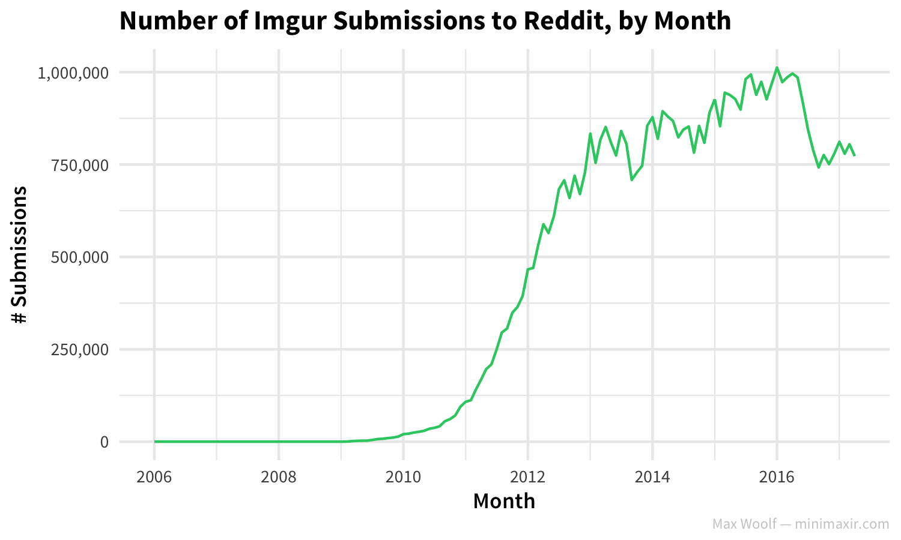
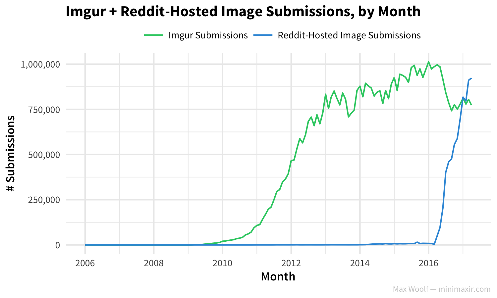
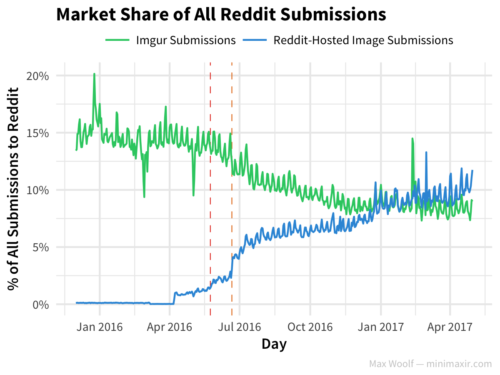
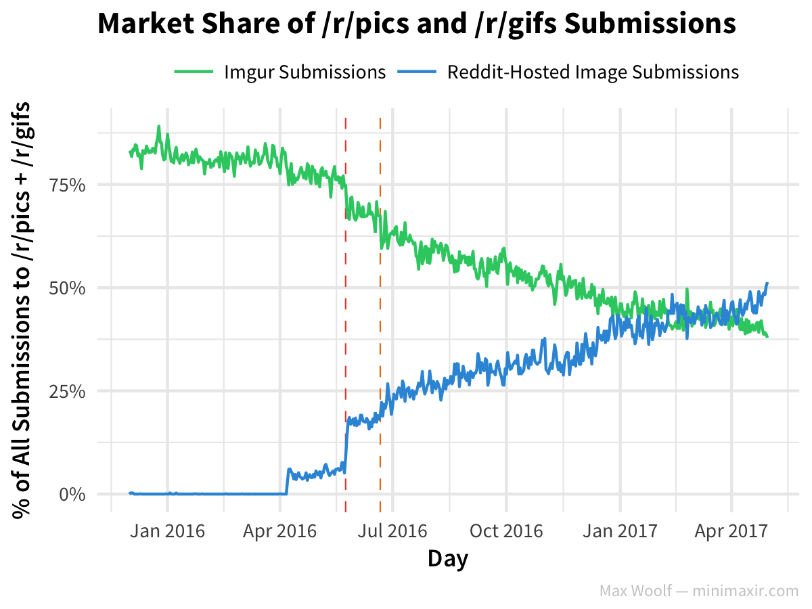

This R Notebook is the complement to my blog post [The Decline of Imgur on Reddit and the Rise of Reddit's Native Image Hosting](http://minimaxir.com/2017/06/imgur-decline/).

This notebook is licensed under the MIT License. If you use the code or data visualization designs contained within this notebook, it would be greatly appreciated if proper attribution is given back to this notebook and/or myself. Thanks! :)

# Setup

```{r}
library(readr)
library(dplyr)
library(ggplot2)
library(scales)
library(bigrquery)
library(tidyr)
library(forcats)

sessionInfo()
theme_set(theme_minimal(base_size=9, base_family="Source Sans Pro") +
            theme(plot.title = element_text(size=11, family="Source Sans Pro Bold"),
                  axis.title.x = element_text(family="Source Sans Pro Semibold"),
                  axis.title.y = element_text(family="Source Sans Pro Semibold"),
                  plot.caption = element_text(size=6, color="#CCCCCC")))
```

Include BigQuery Project name (NEVER share with anyone!)

```{r}
project <- "<FILL IN>"
```

Reddit is blue, Imgur is green.

Also, hard-code dates for vertical lines.

```{r}
site_colors <- c(Reddit="#3498db", Imgur="#2ecc71")

reddit_image_beta_date <- as.numeric(as.Date('2016-05-24'))
reddit_image_sitewide_date <- as.numeric(as.Date('2016-06-21'))
```


# Exploratory Reddit Data

Get Reddit submission data over time.

```{r}
sql <- "
#standardSQL 
SELECT DATE_TRUNC(DATE(TIMESTAMP_SECONDS(created_utc)), MONTH) as mon,
  COUNT(*) as num_submissions,
  COUNTIF(REGEXP_CONTAINS(domain, 'reddituploads.com|redd.it')) as num_reddit_image_submissions,
  COUNTIF(REGEXP_CONTAINS(domain, 'imgur.com')) AS num_imgur_submissions
  FROM `fh-bigquery.reddit_posts.*`
  WHERE (_TABLE_SUFFIX BETWEEN '2016_01' AND '2017_04' OR _TABLE_SUFFIX = 'full_corpus_201512')
  GROUP BY mon
  ORDER BY mon
"

df_reddit_daily <- query_exec(sql, project = project, use_legacy_sql = FALSE)
```

```{r}
df_reddit_daily %>% tail()
```

```{r}
plot <- ggplot(df_reddit_daily, aes(mon, num_submissions)) +
          geom_line() +
          scale_x_date() +
          scale_y_continuous(labels = comma) + 
          labs(title = "Number of Submissions to Reddit, by Month",
               x = "Month",
               y = "# Submissions",
               caption = "Max Woolf — minimaxir.com")

ggsave( "reddit-1.png", plot, width=5, height=3)
```


```{r}
plot <- ggplot(df_reddit_daily, aes(mon, num_imgur_submissions)) +
          geom_line(color=site_colors[2]) +
          scale_x_date() +
          scale_y_continuous(labels = comma) + 
          labs(title = "Number of Imgur Submissions to Reddit, by Month",
               x = "Month",
               y = "# Submissions",
               caption = "Max Woolf — minimaxir.com")

ggsave( "reddit-2.png", plot, width=5, height=3)
```



Must reshape df with `tidyr` to plot reddit + imgur on one plot:

```{r}
df_reddit_daily_reshape <- df_reddit_daily %>%
                    gather(service, num_subs, num_imgur_submissions, num_reddit_image_submissions, factor_key=T) %>%
                    mutate(service = fct_recode(service, "Imgur" = "num_imgur_submissions", "Reddit" = "num_reddit_image_submissions"))

df_reddit_daily_reshape %>% head()
```

```{r}
plot <- ggplot(df_reddit_daily_reshape, aes(mon, num_subs, color=service)) +
          geom_line() +
          scale_x_date() +
          scale_y_continuous(labels = comma) + 
          scale_color_manual(values=site_colors, labels=c("Imgur Submissions", "Reddit-Hosted Image Submissions")) +
          theme(legend.position="top", legend.margin=margin(t = -0.1, b = -0.25, unit='cm')) +
          labs(title = "Imgur + Reddit-Hosted Image Submissions, by Month",
               x = "Month",
               y = "# Submissions",
               caption = "Max Woolf — minimaxir.com",
               color='')

ggsave("reddit-3.png", plot, width=5, height=3)
```



# Market Share

```{r}
sql <- "
#standardSQL 
SELECT DATE_TRUNC(DATE(TIMESTAMP_SECONDS(created_utc)), day) as day,
  COUNTIF(REGEXP_CONTAINS(domain, 'reddituploads.com|redd.it'))/COUNT(*) as Reddit,
  COUNTIF(REGEXP_CONTAINS(domain, 'imgur.com')) /COUNT(*) as Imgur
  FROM `fh-bigquery.reddit_posts.*`
  WHERE (_TABLE_SUFFIX BETWEEN '2015_12' AND '2017_04')
  GROUP BY day
  ORDER BY day
"

df_reddit_perc_all <- query_exec(sql, project = project, use_legacy_sql = FALSE)
```

```{r}
df_reddit_perc_all %>% tail()
```

```{r}
df_reddit_perc_all_reshape <- df_reddit_perc_all %>%
                    gather(service, perc, Imgur, Reddit, factor_key=T)

df_reddit_perc_all_reshape %>% head()
```


```{r}
plot <- ggplot(df_reddit_perc_all_reshape, aes(day, perc, color=service)) +
          geom_vline(xintercept=reddit_image_beta_date, color="#e74c3c", linetype="dashed", size=0.25) +
          geom_vline(xintercept=reddit_image_sitewide_date, color="#e67e22", linetype="dashed", size=0.25) +
          geom_line(size = 0.5) +

          scale_x_date(labels = date_format("%b %Y"), breaks=pretty_breaks(6)) +
          scale_y_continuous(labels = percent) + 
          scale_color_manual(values=site_colors, labels=c("Imgur Submissions", "Reddit-Hosted Image Submissions")) +
          theme(legend.position="top", legend.margin=margin(t = -0.1, b = -0.25, unit='cm')) +
          labs(title = "Market Share of All Reddit Submissions",
               x = "Day",
               y = "% of All Submissions to Reddit",
               caption = "Max Woolf — minimaxir.com",
               color='')

ggsave("reddit-4.png", plot, width=4, height=3)
```



Look at only submissions in /r/pics and /r/gifs:

```{r}
sql <- "
#standardSQL 
SELECT DATE_TRUNC(DATE(TIMESTAMP_SECONDS(created_utc)), day) as day,
  COUNTIF(REGEXP_CONTAINS(domain, 'reddituploads.com|redd.it'))/COUNT(*) as Reddit,
  COUNTIF(REGEXP_CONTAINS(domain, 'imgur.com')) /COUNT(*) as Imgur
  FROM `fh-bigquery.reddit_posts.*`
  WHERE (_TABLE_SUFFIX BETWEEN '2015_12' AND '2017_04')
  AND subreddit IN ('pics', 'gifs')
  GROUP BY day
  ORDER BY day
"

df_reddit_perc_pics <- query_exec(sql, project = project, use_legacy_sql = FALSE)
```

```{r}
df_reddit_perc_pics_reshape <- df_reddit_perc_pics %>%
                    gather(service, perc, Imgur, Reddit, factor_key=T)

plot <- ggplot(df_reddit_perc_pics_reshape, aes(day, perc, color=service)) +
          geom_vline(xintercept=reddit_image_beta_date, color="#e74c3c", linetype="dashed", size=0.25) +
          geom_vline(xintercept=reddit_image_sitewide_date, color="#e67e22", linetype="dashed", size=0.25) +
          geom_line(size = 0.5) +
          scale_x_date(labels = date_format("%b %Y"), breaks=pretty_breaks(6)) +
          scale_y_continuous(labels = percent) + 
          scale_color_manual(values=site_colors, labels=c("Imgur Submissions", "Reddit-Hosted Image Submissions")) +
          theme(legend.position="top", legend.margin=margin(t = -0.1, b = -0.25, unit='cm')) +
          labs(title = "Market Share of /r/pics and /r/gifs Submissions",
               x = "Day",
               y = "% of All Submissions to /r/pics + /r/gifs",
               caption = "Max Woolf — minimaxir.com",
               color='')

ggsave("reddit-5.png", plot, width=4, height=3)
```



# Imgur Direct vs. Indirect

```{r}
sql <- "
#standardSQL 
SELECT DATE_TRUNC(DATE(TIMESTAMP_SECONDS(created_utc)), day) as day,
COUNTIF(domain = 'imgur.com' OR domain = 'm.imgur.com')/COUNTIF(REGEXP_CONTAINS(domain, 'imgur.com')) as Indirect,
  COUNTIF(domain = 'i.imgur.com')/COUNTIF(REGEXP_CONTAINS(domain, 'imgur.com')) as Direct
  FROM `fh-bigquery.reddit_posts.*`
  WHERE (_TABLE_SUFFIX BETWEEN '2015_12' AND '2017_04')
  GROUP BY day
  ORDER BY day
"

df_imgur_direct <- query_exec(sql, project = project, use_legacy_sql = FALSE)
```

```{r}
df_imgur_direct %>% tail()
```

```{r}
df_imgur_direct_reshape <- df_imgur_direct %>%
                    gather(service, perc, Direct, Indirect, factor_key=T)

plot <- ggplot(df_imgur_direct_reshape, aes(day, perc, color=service)) +
          geom_line(size = 0.5) +
          scale_x_date(labels = date_format("%b %Y"), breaks=pretty_breaks(6)) +
          scale_y_continuous(labels = percent) + 
          scale_color_hue(l=65, h.start = 10, labels=c("Direct Link to Image", "Indirect Link to Imgur Website")) +
          theme(legend.position="top", legend.margin=margin(t = -0.1, b = -0.25, unit='cm')) +
          labs(title = "Breakdown of Direct vs. Indirect Imgur Links",
               x = "Day",
               y = "% of All Imgur Submissions to Reddit",
               caption = "Max Woolf — minimaxir.com",
               color='')

ggsave("reddit-6.png", plot, width=4, height=3)
```


# LICENSE

The MIT License (MIT)

Copyright (c) 2017 Max Woolf

Permission is hereby granted, free of charge, to any person obtaining a copy of this software and associated documentation files (the "Software"), to deal in the Software without restriction, including without limitation the rights to use, copy, modify, merge, publish, distribute, sublicense, and/or sell copies of the Software, and to permit persons to whom the Software is furnished to do so, subject to the following conditions:

The above copyright notice and this permission notice shall be included in all copies or substantial portions of the Software.

THE SOFTWARE IS PROVIDED "AS IS", WITHOUT WARRANTY OF ANY KIND, EXPRESS OR IMPLIED, INCLUDING BUT NOT LIMITED TO THE WARRANTIES OF MERCHANTABILITY, FITNESS FOR A PARTICULAR PURPOSE AND NONINFRINGEMENT. IN NO EVENT SHALL THE AUTHORS OR COPYRIGHT HOLDERS BE LIABLE FOR ANY CLAIM, DAMAGES OR OTHER LIABILITY, WHETHER IN AN ACTION OF CONTRACT, TORT OR OTHERWISE, ARISING FROM, OUT OF OR IN CONNECTION WITH THE SOFTWARE OR THE USE OR OTHER DEALINGS IN THE SOFTWARE.
